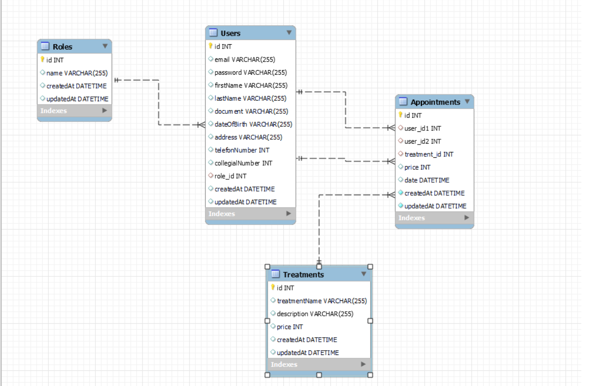

<h1 align="center">Welcome to my backend app</h1>

<h1 align="center">PHP-LARAVEL project in Geekshubs Academy FSD 04-2023</h1>


<details>
  <summary>Contet: 📝</summary>
  <ol>
    <li><a href="#target">Target</a></li>
    <li><a href="#about-the-project">About the project</a></li>
    <li><a href="#stack">Stack</a></li>
    <li><a href="#diagrama-bd">Diagrama</a></li>
    <li><a href="#installation">Installation</a></li>
    <li><a href="#endpoints">Endpoints</a></li>
    <li><a href="#contributions">Contributions</a></li>
    <li><a href="#license">License</a></li>
    <li><a href="#webgrafia">Webgrafia</a></li>
    <li><a href="#acknowledgments">Acknowledgments</a></li>
    <li><a href="#contacts">Contacts</a></li>
  </ol>
</details>

## Target
in this project we have put into practice the knowledge with PHP, Laravel. Using as a template the previous project of the Dental Clinic made in Sequelize.

## About the project
This project consisted of creating a web application for a dental clinic, in which we would have several features such as:
- user registration
- login access
- access to user profile
- profile modification according to permissions
- access to appointments and their modification
- view own appointments (user) 
- view all appointments according to permissions

I was investigating several apps of this style to see the structure and to be able to better apply all the points and functionalities. 

## Stack
<p>Technologies that has been used:</p>
<div align="center">

    

</div>


## Diagrama BD


## Installation

1. Clone the repository `$git clone 'url-repository'`.
2. Install the dependencies `$composer install`.
3. Create the `.env` file and set up the database
4. Execute the `php artisan migrate` `php artisan db:seed` migrations and seeders.
5. Connect the server `php artisan serve`.
 

## Endpoints
<details>
<summary>Endpoints</summary>

- AUTH
    - REGISTER

            Route::post('/register', [AuthController::class, 'register']);
        body:
        ``` js
            {
                'email' => 'required|email|unique:users,email',
                'password' => ['required', Password::min(8)->mixedCase()->numbers()],
                'firstName' => 'required|string',
                'lastName' => 'required|string',
                'document' => 'required|string',
                'dateOfBirth' => 'required|string',
                'address' => 'required|string',
                'telefonNumber' => 'required|string',
                'collegialNumber' => 'required|integer',
            }
        ```

    - LOGIN

            Route::post('/login', [AuthController::class, 'login']); 
        body:
        ``` js
            {
                'email': 'test@test.com',
                'password': 'Name1234'
            }
        ```
</details>

- Create appointment:
    - Create appointment only for the logged in user through postman with POST option.

             Route::post('/appointment', [AppointmentController::class, 'createAppointment'])->middleware('auth:sanctum');
        body:
        ``` bash
        {
            'doctor_id' => 'required|integer',
            'treatment_id' => 'required|integer',
            'date' => 'required|date'
        }
        ```
- Cancel appointment : 
    - CANCEL petition to delete any user appointments currently in the database.
  
            Route::delete('/appointments/{id}', [AppointmentController::class, 'deleteAppointment'])->middleware('auth:sanctum');
    You must indicate in the url the ID number of the appointment.
- Check all appointments by Admin: 
    - GET a list of all users' appointments.
  
            Route::get('/appointments', [AppointmentController::class, 'getAllAppointments'])->middleware('auth:sanctum', 'isAdmin');

- Check personal appointment by User: 
    - GET a list of all appointments.

            Route::get('/appointments/{id}', [AppointmentController::class, 'getMyAppointment'])->middleware('auth:sanctum');
   
- Check profile: 
    - GET petition to see the user´s own profile.
  
            Route::get('/profile', [UserController::class, 'profile'])->middleware('auth:sanctum');
- Update profile: 
    - We update profile from the logged user.
  
            Route::post('/user', [UserController::class, 'createUser'])->middleware('auth:sanctum');
        body:
    
        ``` bash
        {
            'email' => 'required|string',
            'firstName' => 'required|string',
            'lastName' => 'required|string',
            'document' => 'required|string',
            'dateOfBirth' => 'required|string',
            'address' => 'required|string',
            'telefonNumber' => 'required|integer',
            'collegialNumber' => 'required|integer',
            'role_id' => 'required'
        }
        ```
- Check all user profiles by Admin: 
    - GET petition to see the user´s profile, if you are logged like an Admin, will show all the information about the users.
  
            Route::get('/users', [UserController::class, 'getAllUsers'])->middleware('auth:sanctum', 'isAdmin');
- Delete treatment by Admin: 

            Route::delete('/treatments/{id}', [TreatmentController::class, 'deleteTreatment'])->middleware('auth:sanctum', 'isAdmin');
    You must indicate in the url the ID number of the treatment.
</details>

- Delete user by Admin:
    - Delete user and all info by Admin.

            Route::delete('/users/{id}', [UserController::class, 'deleteUser'])->middleware('auth:sanctum', 'isAdmin');

        is required user_id.

- Create treatment:
    - Create treatment :

            Route::post('/treatment', [TreatmentController::class, 'createTreatment'])->middleware('auth:sanctum');
        body:
        ``` bash
        {
            'treatmentName' => 'required|string',
            'description' => 'required|string'
        }
        ```
</details>


## Contributions
Suggestions and contributions are always welcome.  

You can do this in two ways:

1. Opening an issue
2. Create a fork of the repository
    - Create a new branch
        ```
        $ git checkout -b feature/nombreUsuario-mejora
        ```
    - Make a commit with your changes 
        ```
        $ git commit -m 'feat: mejora tal parte'
        ```
    - Make push to the branch 
        ```
        $ git push origin feature/nombreUsuario-mejora
        ```
    - Open a Pull Request

## Licencia
This project is belonging to license Creative Commons Legal Code.

## Webgrafia:
To achieve my goal I have collected information from:
- [Sequelize documentation](https://sequelize.org/docs/v6/)
- [Repository GeeksHubs](https://github.com/GeeksHubsAcademy/2023_04_VAL_AUTH_SEQUELIZE)  

## Acknowledgments:

I thank my teachers for their time dedicated to this project:

- ***Dani***  
<a href="https://github.com/Datata" target="_blank"></a> 

- ***Jose***  
<a href="https://www.github.com/JoseMarin" target="_blank"></a>

- ***David***  
<a href="https://www.github.com/Dave86dev" target="_blank"></a>

- ***Mara***  
<a href="https://www.github.com/MaraScampini" target="_blank"></a> 

## Contacts
<a href = "mailto:anastasiakosovets@gmail.com"></a>
<a href="https://www.linkedin.com/in/anastasia-kosovets-00022917b/" target="_blank"></a> 
</p>